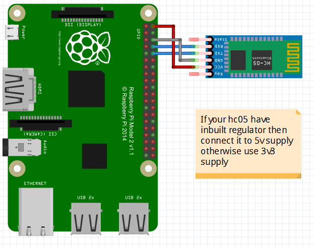
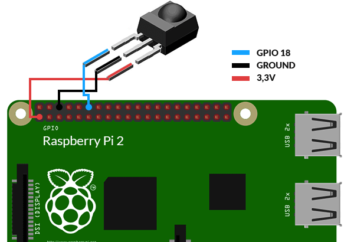

# Emergency data identification and sending

## Introduction

The main aim of the project is to control the network congestion effectively and increase the network throughput in wireless sensor networks.

A wireless sensor network is a wireless network consisting of spatially distributed autonomous devices using sensors to monitor physical or environmental conditions. Sensor senses the data from the environment and generates a packet. The packets transmit to the destination. Most of the packets are regular packets. However, when the urgent events occur, some emergency packets are generated, which need to be delivered to destination node in a certain deadline. To solve this problem we have using scheduling scheme. Many scheduling schemes available for the sensor networks, such as Collection Tree, ZigBee etc. However these scheme cannot guarantee the throughput of networks. In proposed, we are implementing backpressure based scheduling scheme, which can effectively control the network congestion and guarantee the throughput of networks. The emergency packets will be prior forwarded, which reduces the waiting delay in queue for emergency event. Furthermore, the shortest path is combined with backpressure scheme for emergency packets.

## About the project

This project consists of an android application and a raspberry pi module which is connected to an HC-05 bluetooth module. The data from the bluetooth module is considered as the wireless medium and when the pi receives any emergency message from any of it's sensors it is given an higher priority and sent over the HC-05 module first.

## Components Used :
1. Raspbery Pi 3
2. IR sensor
3. HC-05 Module
4. Android Device

## Pin Diagram

#### 1. HC-05 Connection

 

#### 2. IR sensor Connection

# Raspberry Pi Role

1. The scheduling of packets in a network is demonstrated using a bluetooth module and a IR sensor.
2. The Bluetooth module continuously sends the IR sensor data packets to an android device
3. When the IR sensor is triggered the packets are given higher priority and first sent to the bluetooth module which in turn sends the packet to the mobile phone.
4. The HC-05 module is connected to the TX and RX pins and when the raspberry pi writes to the TX port,the module will send the packet to the phone.
5. The IR sensor is connected to the GPIO pin 23 pin and the data is gathered through a python code file that runs in rc.local (which runs on start up).

# Android application role

1. The android application connects to the bluetooth device of raspberry pi and starts reading the data.
2. It holds a counter for every data packet received.
3. When the emergency packets are received it is shown in read text.
